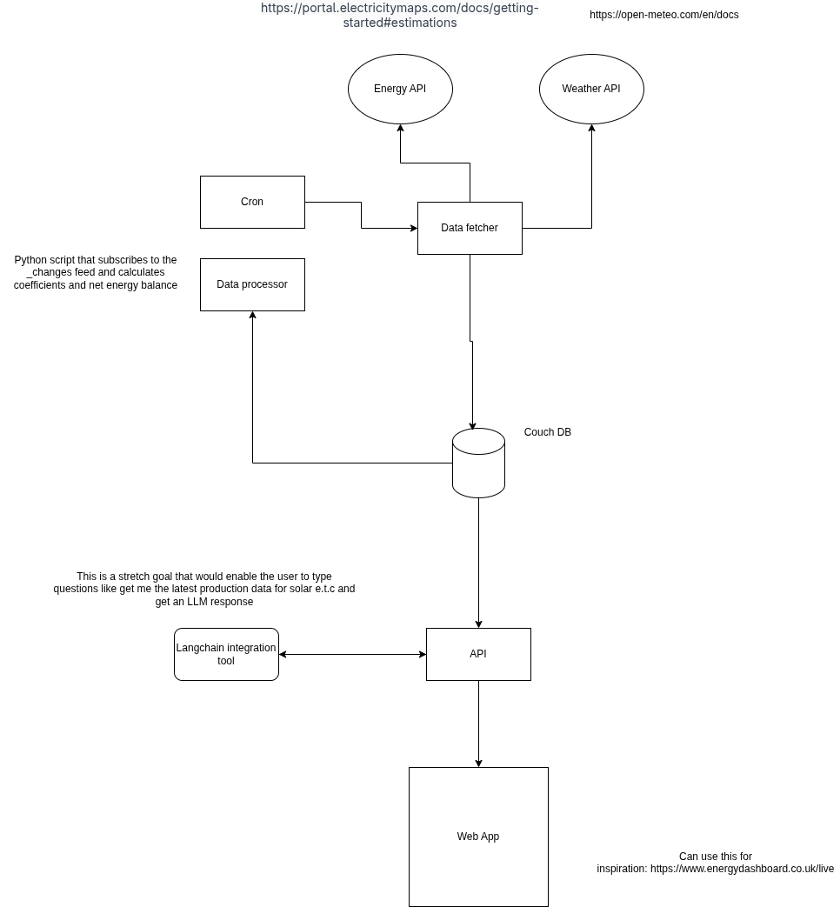

# Zendo Test Energy Dashboard

# Architecture



# TODO:

- Add tests

### Requirements To Run

- make
- docker & docker compose
- curl
- bash
- an electricity maps api key (they have a free account tier)

### Developer Requirements

All above and:

- golang
- uv
- node 22 (latest lts as of creation)

### Getting Started

In order to start this amazing energy dashboard first setup required environment variables.

In each folder where you find a `.env.example` file, create a `.env` file and fill in the missing values.

```sh
make start
```

this will start the stack, setup the database and seed the database with an initial data set.

Navigate to `http://localhost:3000` and see your dashboard!

### Assumptions

- Weather is taken from York
- Charts are all driven by energy data availability, there may be many more weather data points available but we wait for energy data before running updates.
- Auth is very basic / non existent for internal networked services. In prod workloads this would be more advanced (certificats, security groups, networking rules e.t.c.)

### Improvements

- TESTS! (Unit & integration).
- Add logging middleware,
- Add authentication and firewalls.
- Rely less on the _changes feed and introduce a robust queue like RabbitMQ - this could be persistent and would remove the need for a query on the DB to perform data processing.
- Database is fine to get started as is very lightweight however, would probably use something like MongoDB to get started and then if scale and queries become an issue supplement with something like Hypertable.
- Dashboard currently polls on a timer, much better to use web sockets which would be easy with the database _changes feed.
